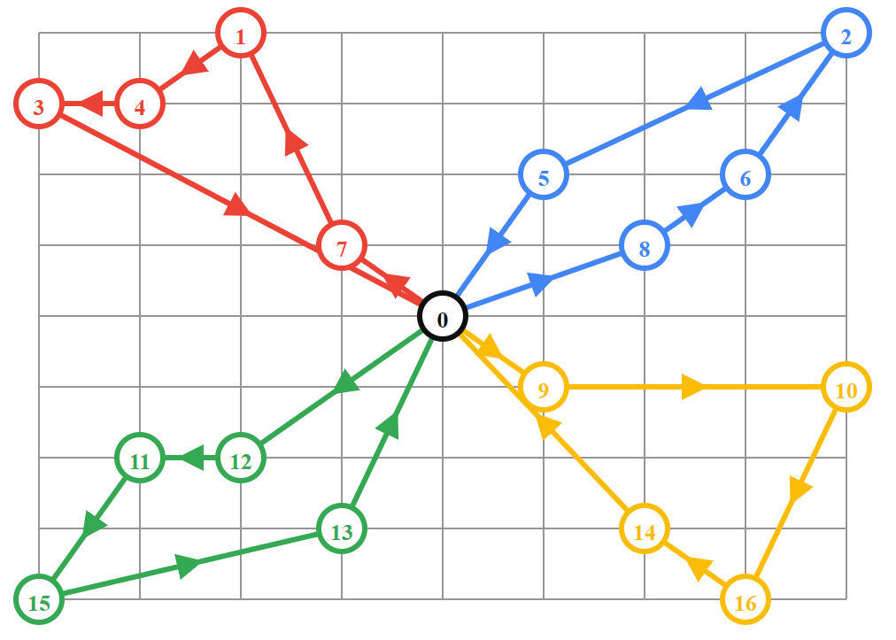

# MIN MAX VEHICLE ROUTING PROBLEM


## Solver
We tested the problem using 4 algorithms such as Greedy, Hill-climbing (HC), Guided Local Search (GLS), Tabu Search (TABU). 
## Requirement
- python 3.8
- numpy
- matplotlib

## How to run
- Set up requirement
- Run the below prompts to see the result 
```
python visualization.py -n 10 -k 2 --algo GREEDY
python visualization.py -n 10 -k 2 --algo GLS
python visualization.py -n 10 -k 2 --algo HC
python visualization.py -n 10 -k 2 --algo TABU
```

## Citing MMVR 
```BibTeX
@article{haopd12,
      title={MMVR using Greedy and Meta heuristic algorithms},
      author={haopd12, yinnxing, cuongnv03, chuongslayer2011},
      year={2023}
}
```